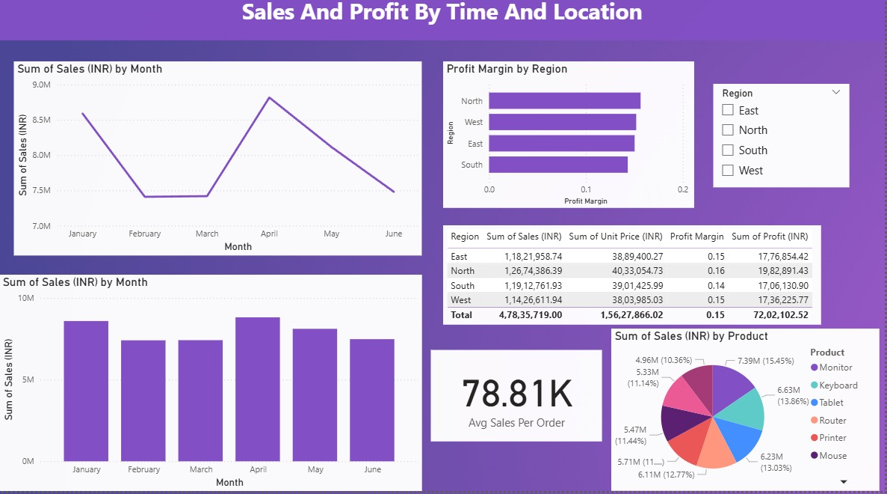
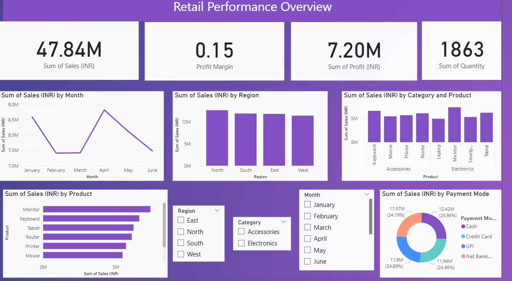

# Retail-Sales-Dashboard

## Overview
The *Retail-Sales-Dashboard* provides a comprehensive overview of retail performance, empowering users to analyze and visualize sales data effectively.

Key insights include:
- *Total Sales and Profit:* High-level summary metrics for overall business health.
- *Category-wise Product Performance:* Compare sales and profitability across product categories.
- *Region-wise Analysis:* Drill down into sales and profit by different geographical regions.
- *Sales and Profit by Time and Location:* Track trends and patterns across various time periods and store locations.

## Workflow

1. *Upload Your Data*
   - Start by uploading your retail sales data in Excel (.xlsx) or CSV (.csv) format.
2. *Data Transformation*
   - Clean and transform your data according to business needs. This may include:
     - Removing duplicates or irrelevant fields
     - Standardizing category and region values
     - Formatting date and currency columns
     - Handling missing or inconsistent data
   - Data cleaning can be done using Excel
3. *Dashboard Visualization*
   - Import the cleaned data into *Power BI*.  
   - Explore interactive visualizations and dashboards for actionable insights.
   - Use filters and slicers to customize your view by product category, region or time period.

## Features

- *User-friendly Data Upload:* Accepts both Excel and CSV files.
- *Flexible Data Cleaning:* Instructions and scripts for transforming raw data into analysis-ready datasets.
- *Advanced Visualization:* Power BI dashboard enables deep exploration with interactive charts, maps, and KPIs.
- *Custom Filtering:* Analyze data by categories, regions and dates.
- *Free to Use:* This dashboard is provided free of charge for personal and commercial use.

## Tech Stack

- *Data Cleaning:* Excel
- *Visualization:* Power BI
- *Supported Formats:* Excel (.xlsx), CSV (.csv)

## Getting Started

1. *Clone this repository:*
   bash
   git clone https://github.com/sharmaasumit/Retail-Sales-Dashboard
   
2. *Prepare Your Data:*
   - Place your sales data file (.xlsx or .csv) in the designated folder.
   - (Optional) Run the provided Excel instructions to clean and format your data.
3. *Open the Dashboard:*
   - Launch Power BI Desktop.
   - Load the cleaned data file.
   - Refresh the dashboard to update visualizations.

## Usage

- Navigate through dashboard tabs to view sales and profit by category, time, and location.
- Use built-in filters and slicers to drill down for deeper analysis.
- Export charts and reports as needed for presentations or further analysis.

## Screenshots

